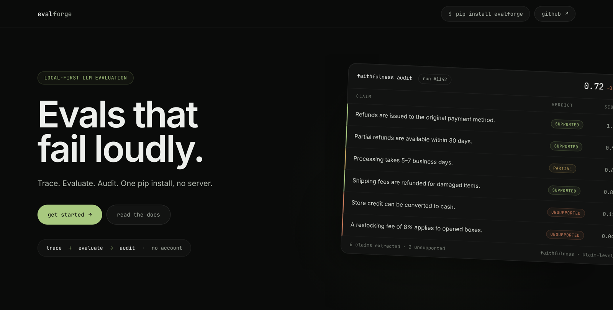
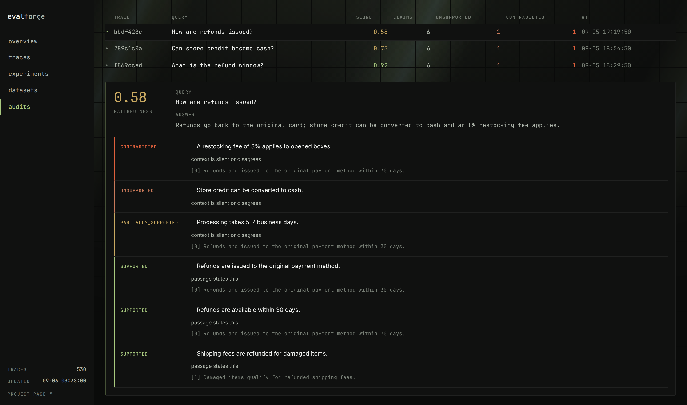

# EvalForge

A local toolkit for **tracing, evaluating, and debugging LLM application pipelines**.

EvalForge records function calls and model usage, stores the results in a local DuckDB
database, and provides tools to compare runs and inspect RAG answers at the claim level.
No server, account, or hosted backend required.

**Python 3.10+ · 6.4k lines · 195 tests · DuckDB · Apache-2.0**

[Landing page](https://swapnil5053.github.io/eval-forge/)



---

## Features

* **Tracing** — instrument functions with `@trace` and record nested calls, latency, tokens, errors, and cost.
* **Evaluation** — run built-in or custom metrics across datasets, with concurrent execution.
* **RAG auditing** — break an answer into individual claims and check each one against retrieved context.
* **Experiment tracking** — store runs and evaluation results in a queryable DuckDB database.
* **Attribution** — inspect which input tokens influence a score, using SHAP or occlusion.
* **Interfaces** — local dashboard, CLI, and MCP server.

---

## Quick start

```bash
pip install evalforge
evalforge init
```

### Tracing

Add `@trace` to the functions you want to inspect:

```python
from evalforge import trace

@trace(name="retrieve", type="retrieval")
def retrieve(question: str):
    return vector_store.search(question)

@trace
def generate(question: str, context: list[str]):
    return client.chat.completions.create(...)

@trace(name="pipeline")
def answer(question: str):
    context = retrieve(question)
    return generate(question, context)
```

Load the traces and inspect them:

```bash
evalforge ingest
evalforge trace stats
evalforge serve
```

Traces are stored locally in:

```text
~/.evalforge/
├── spool/
└── evalforge.db
```

The database is plain DuckDB, so it can also be queried directly:

```bash
duckdb ~/.evalforge/evalforge.db \
  "SELECT name, model, estimated_cost_usd FROM spans"
```

---

## Evaluation

Eight metrics ship with the package:

```text
faithfulness
hallucination
answer_relevance
context_precision
context_recall
toxicity
coherence
conciseness
```

Metrics are regular Python functions rather than objects with a required interface. The
runner inspects each signature and passes only the arguments that function asks for, so a
custom metric is written the same way as a built-in one.

```python
from evalforge import evaluate
from evalforge.eval.metrics import faithfulness, hallucination

results = evaluate(
    dataset="my_dataset",
    task=my_pipeline,
    metrics=[faithfulness, hallucination],
    num_workers=4,
    name="experiment-1",
)
```

Evaluation goes through LiteLLM, so the judge model can be changed without touching the
evaluation code. Local models such as Ollama work too, which keeps the loop offline.

---

## RAG claim audit

A single faithfulness score does not show *which part* of an answer is wrong. The audit
splits an answer into claims and compares each claim with the context the application
actually retrieved.



```bash
evalforge audit run 1b4343ea
```

Each claim gets one of four verdicts:

```text
SUPPORTED             the context states it
PARTIALLY_SUPPORTED   the context implies part of it
UNSUPPORTED           the context is silent
CONTRADICTED          the context says otherwise
```

Claims are ranked by severity, with contradictions treated as more serious than missing
evidence — the context was there and the answer went against it.

An audit costs two model calls:

1. Extract the claims from the answer.
2. Classify each claim against the retrieved context.

---

## Architecture

```text
Application
    │
    │ @trace
    ▼
NDJSON spool
    │
    │ ingest
    ▼
DuckDB
 ┌──┼──────────┐
 ▼  ▼          ▼
CLI Dashboard  MCP
    │
    ▼
Evaluation
    │
    ├── Metrics
    ├── Experiments
    └── RAG audits
```

The application never writes to DuckDB. `@trace` appends events to a per-process NDJSON
file, and the ingester moves those events into the database later. This keeps tracing off
the hot path and avoids several application processes competing for a write lock DuckDB
only grants to one of them.

---

## Engineering details

### Non-blocking tracing

Trace events go to spool files rather than to the database. A file being written is named:

```text
*.ndjson.active
```

and is renamed once sealed, so the ingester never reads a half-written line. A file
abandoned by a crashed process is adopted after a timeout.

### Score polarity

Every score records whether a higher value is better:

```text
faithfulness   → higher is better
hallucination  → lower is better
toxicity       → lower is better
```

Consumers read the declared polarity instead of assuming every score points the same way,
so nothing in the codebase hard-codes "low is bad".

### Cost accounting

One model response can pass through several traced functions. Responses are fingerprinted
by identity and usage, so a wrapper that returns its child's response is not charged for
tokens it did not request.

### Read-only inspection

The dashboard and the MCP server open DuckDB read-only, so both keep working while an
evaluation run holds the write lock.

---

## Project structure

```text
src/evalforge/
├── core/
│   ├── tracer
│   ├── context
│   ├── spool
│   └── cost
│
├── storage/
│   ├── duckdb_store
│   ├── migrations
│   ├── ingest
│   └── queries
│
├── eval/
│   ├── metrics
│   ├── judge
│   ├── dataset
│   ├── experiment
│   ├── faithfulness_audit
│   └── attribution
│
├── dashboard/
├── mcp/
└── cli/
```

---

## Stack

| Area | Technology |
| --- | --- |
| Language | Python 3.10+ |
| Storage | DuckDB |
| Evaluation | LiteLLM |
| Attribution | SHAP |
| Dashboard | Reflex |
| CLI | Click + Rich |
| Testing | Pytest |
| Integration | MCP |
| Data format | NDJSON |
| Containers | Docker |

---

## Installation options

| Extra | Includes |
| --- | --- |
| `evalforge` | Tracing, storage, CLI |
| `evalforge[eval]` | Evaluation and LiteLLM |
| `evalforge[dashboard]` | Dashboard |
| `evalforge[mcp]` | MCP server |
| `evalforge[attribution]` | SHAP attribution |
| `evalforge[all]` | All components |

---

## MCP

EvalForge includes an MCP server for querying traces and experiments from compatible
clients such as Claude or Cursor.

```bash
evalforge mcp install
```

Available operations:

```text
list_traces
get_trace
get_trace_stats
search_traces
list_experiments
get_experiment
run_faithfulness_audit
```

---

## Docker

```bash
docker compose up --build
```

One container with the dashboard and embedded DuckDB, storage on a named volume, running
as a non-root user, with a health check.

---

## Development

```bash
pip install -e ".[all]"
python -m pytest
python examples/rag_pipeline.py
evalforge ingest
evalforge trace stats
```

Current test suite:

```text
195 tests
```

`docs/index.html` is the landing page — a self-contained file with no build step. Open it
directly, or point GitHub Pages at `docs/`.

---

## Attribution

EvalForge is derived in part from [Opik](https://github.com/comet-ml/opik) by Comet ML.
The tracing decorator pattern, context propagation model, and judge prompt rubrics were
adapted from the Opik Python SDK. The storage layer, dashboard, claim-level audit system,
attribution module, MCP server, CLI, and surrounding architecture were implemented
independently.

See [ATTRIBUTION.md](ATTRIBUTION.md) for the detailed breakdown.

---

## License

Apache-2.0, inherited from Opik. See [LICENSE](LICENSE).
